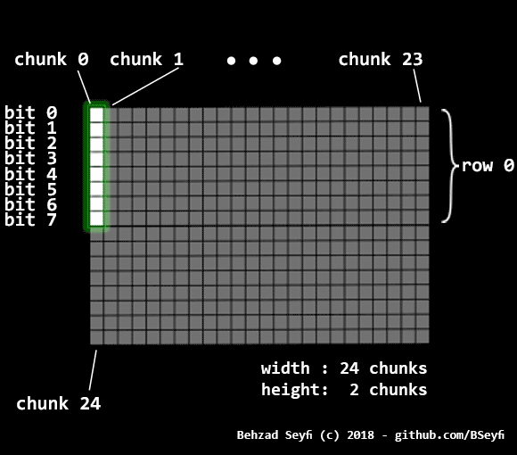
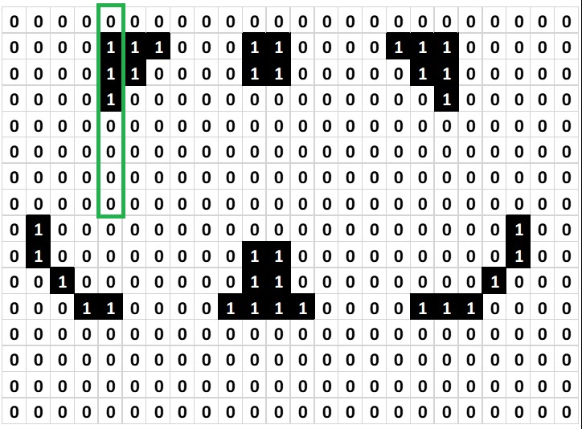
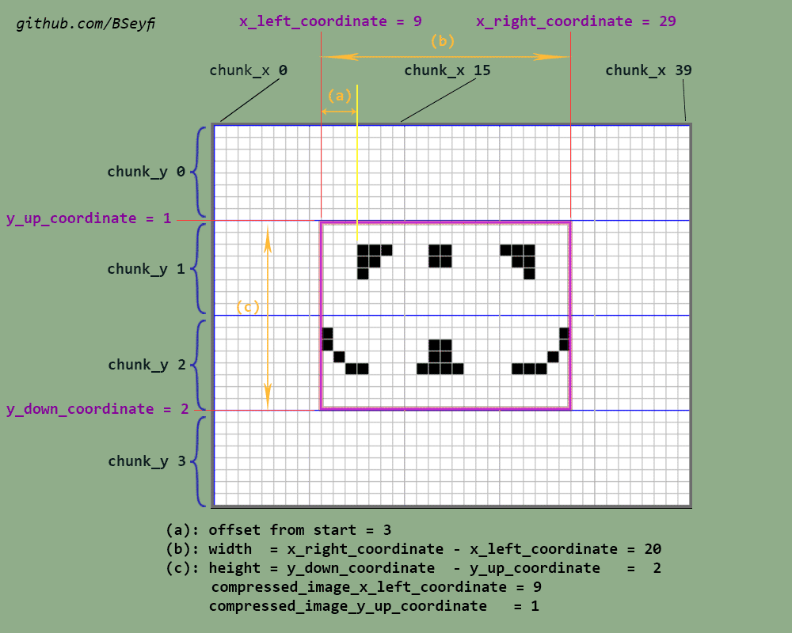

# Bicolor image compression protocol for embedded systems

This protocol is designed to compress bicolor images for embedded systems. These images are small(very small) in size but need an appropriate amount of compression due to tight amount memory available in microcontrollers; also this protocol should be fast to decompress (i.e. few clock cycles are needed.). This protocol created to make a balance between size and fast decompression speed. It's also lossless.

**NOTE:** This protocol is dedicated for bicolor (Black and white in general) LCDs with the ability to access to pixels or chunk of pixels.

## Summary
- ### Preface
  - ### [How bicolor LCDs work?](#how-lcd-works)
- ### Protocol structure
  - ### [How compression protocol works?](#how-protocol-works)
- ### [Tools using this protocol for compression and decompression](#tools)
- ### [License](#license)

- - -


In bicolor LCD just two colors are imaginable, White or Black, or in simple words, a pixel is on or off. So for each pixel, just one bit is needed. Suppose we have an LCD with 24 pixels width and 16 pixels height. Each byte of data that we send to LCD consists of 8 bits, each bit to correspond to one and just one pixel, so as you see in below picture, we should send 8 pixels data, packed in a byte in every clock cycle.<br/>

<a name="how-lcd-works"/>

### How bicolor LCDs work?


###### Fig.1 Chunk and bytes sending to LCD

We define a term  **chunk**, meaning 8 vertical pixels forms a byte to send to LCD (You can see a sample chunk in green rectangle in *Fig.1* ). Most top pixel makes the least significant bit and most down pixel makes the most significant bit of that byte. *Fig.1* represents an LCD with 24 chunks but 2 rows of chunks (16pixels / 8 = 2 chunks)<br/>


###### Fig.2 How bits forms pixels and an image

As you see in *Fig.2*, green rectangle indicates chunk 4 (fifth chunk because chunk numbering starts from zero, like array numbering in C language). This chunk's value is equal to 0b00001110 == 63 . Sending data to LCD starts from chunk 0 then chunk 1, chunk 2 and so on. LCD can get just one chunk or multiple chunks starting from *n* and finishes to *n+m* .<br/>
LCDs may be cleared at restart point or they may be clear by the program at the middle or start point, so we need just send chunks that have 1s in them, or send all chunks without considering to their data. No problem!

<a name="how-protocol-works"/>

### How compression protocol works?

In a simple word, it keeps data chunks(chunks that are not empty meaning not equal to 0) and discards empty chunks, just counts the amount of them.<br/>
Let's explain: This protocol has a simple header(It will be explained later.), then the data part. The data part contains some fragments. Each fragment constitutes of one or two bytes for the amount of non-empty contiguous chunks, after that, one or two bytes for amount empty contiguous chunks, and then first contiguous data chunks value. This repeats for all parts of images sequentially. Last part has some data chunks but no empty chunk needs to transfer, so empty chunk amount is zero. This is the sign of `End of data`.

**Protocol in details:**

##### 1. Find Inner Frame

First, we should find the smallest frame that whole non-blank chunks fit in. *Look at Figure 3.*


###### Fig.3 Protocol measurements

Calculate the `width` and `height` of the inner frame with `offset` value.

#### 2. Create  array

The compressed array has been created from two main parts:
1. **Header part**
2. **Data part**

<table>
<thead>
<tr>
<th style="text-align:center">Description:</th><td align="center" colspan="4"><strong>Header Part</strong></td>
<th><strong>Data part </strong></th>
</tr>
</thead>
<tbody>
<tr>
<td style="text-align:center"><strong>Content:</strong></td>
<td>byte 0</td>
<td>byte 1,1+</td>
<td>byte 2,2+</td>
<td>byte 3,3+</td>
<td>data part bytes</td>
</tr>
</tbody>
</table>

###### Table 1. Bytes arrangement in compressed array

##### 1. Header part

header part is made up of 4 or more bytes:
- **first byte   :** protocol and image identification
- **second byte**: width of inner frame in chunks
- **third byte** : height of inner frame in chunks
- **fourth byte**: offset of inner frame in chunks

**Important Notice:** These bytes each, can be extended to two bytes if needed(and one byte for the flag, three bytes in whole). If byte's value is lower than 255 (0xFF) then one byte suffices but if the byte is equal or more than 255 (0xFF) up to 65536 (0xFFFF) then we need two bytes. We just need to check the first byte and update its value if needed as follow :
```c
//index points to the current reading byte of the compressed array
uint16_t value = compressed_image[index++];
if (value == 255){
  value = compressed_image[index++];
  value = ( value << 8 ) + compressed_image[index++];
}
```

###### How to interpret header bytes

This block of code or something like that is needed for all four header bytes. (For first block it is optional as we are in the first version). This means the aforementioned block should repeat 4 times ( 3 times if you just use version 1 ).

**First-byte** contains some data about protocol version and whole image dominant color. if the dominant color is white `Inverted` bit is 0 but if the dominant color is black then `Inverted` bit is 1. `Inverted` bit tells us free spaces color. The version of this protocol, now, is 1. We set version to 1 with setting bit 4 with 0.

bit 7 | bit 6 | bit 5 |bit 4 | bit 3 | bit 2 | bit 1 | bit 0
--|---|---|---|---|---|---|--
Reserved = 0  | 0 | 0 | Version = 0 | 0 | 0 | 0 | Inverted

###### Table 2. First byte - Protocol Identification

**Second, third and fourth bytes** are all values and should be interpreted with regard to its value. (You can use aforementioned code to interpret it.)

#### 2. Data part

The data part is created of some fragments. Each fragment contains 2 or 2+ beginner bytes and some continuing bytes. The amount of continuing bytes is equal to beginner byte/bytes value, so each fragment is separable from other. *Look at Table 3 and 4.*

<table>
<thead>
<tr>
<td align="center" colspan="4"><strong>Data part</strong></td>
</tr>
</thead>
<tbody>
<tr>
<td>Fragment 1</td>
<td>Fragment 2</td>
<td>...</td>
<td>Fragment n</td>
</tr>
</tbody>
</table>

###### Table 3. Fragmented nature of Data part

<br>

<table>
<thead>
<tr>
<th>Description:</th>
<th>Non-blank chunk count</th>
<th>Blank chunk count</th><td colspan="4"><strong>Non white(or Black if inverted=1) chunks value in order</strong></td>
</tr>
</thead>
<tbody>
<tr>
<td>Byte value:</td>
<td>0-254<sup>(1)<sup></sup></sup></td>
<td>0-254<sup>(1)<sup></sup></sup></td>
<td>byte 1: 0-255</td>
<td>byte 2: 0-255</td>
<td>...</td>
<td>byte n: 0-255</td>
</tr>
</tbody>
</table>

(1): If the value is 255 up to 65536 then three bytes needed as explained in *Important Notice* before.

###### Table 4. Whole bytes exist in each fragment and their order

**The last chunk**: We used a low footprint and also a simple
trick to denote `End of array`. As you see, the last fragment has some non-blank chunks but after that, it may have any number of blank chunks. As it doesn't matter how many chunks are blank after last non-blank data(because we don't have more data chunks nor we don't need to send blank data to LCD and also we can Calculate it if we need it in some cases ), therefore we can use `blank_chunk_count==0` as a flag to `End of Array`.

#### Example:

Lets convert [image](./images/out32x24.bmp) that is fully shown in *Fig 3.* We made a tool to convert images to compressed array using this protocol. This tool is available for free here: [BICTES *1-bit Bitmap Image Compression Tool for Embedded Systems*](https://github.com/BSeyfi/BICTES)
 Compressed array is this:

 ```c
 const uint8_t image_compressed[] = { 0, 21, 2, 3, 3, 3, 28, 12, 4, 2, 4, 12, 12, 3, 3, 4, 12, 28, 4, 4, 6, 8, 16, 16, 4, 4, 16, 28, 28, 16, 5, 0, 16, 16, 16, 8, 6, };
 ```
 First four bytes are header, tells that

- Version=1,
- Inverted=0,
- Width=21,
- Height=2,
- Offset = 21

Next bytes are all Fragmented bytes:

Fragment 1: 3, 3, 28, 12, 4, means:

 - 3  bytes are non-blank chunks,
 - 3  byte are blank chunks,
 - 28 1st chunk value,
 - 12 2nd chunk value,
 - 4  3rd chunk value,


Now all three chunks are read and (your embedded) program makes another 3 blank chunks then go on reading next fragment that is `2, 4, 12, 12,`. This is like above, 2 non-blank chunks, 4 blank chunks, 12 1-st chunk value, 12 2nd chunk value and then program makes 4 blank chunks.

 Reading compressed array and filling buffer continues until we read first `blank_chunk==0`. This is the last fragment: `5, 0, 16, 16, 16, 8, 6,` as you see, there are 5 non-blank chunks 0 blank chunks and five chunks value. The program adds that five non-blank chunks values to buffer and finishes decompress process because we reached to firs `blank_chunk` that is equal to zero.

 <a name="tools" />

 ### Tools using this protocol for compression and decompression

 - For compressing images into compressed aray using this protocol use:
   - [BICTES *1-bit Bitmap Image Compression Tool for Embedded Systems*](https://github.com/BSeyfi/BICTES)
 - For decompression :
   - [Nokia 5110/3310 LCD Driver for STM32 ARM Microcontrollers](https://github.com/BSeyfi/LCD-5110-driver)


<a name="license"/>

 ### License

 Copyright 2018 Behzad Seyfi

Licensed under the Apache License, Version 2.0 (the "License");
you may not use this file except in compliance with the License.
You may obtain a copy of the License at

[http://www.apache.org/licenses/LICENSE-2.0](http://www.apache.org/licenses/LICENSE-2.0)

Unless required by applicable law or agreed to in writing, software
distributed under the License is distributed on an "AS IS" BASIS,
WITHOUT WARRANTIES OR CONDITIONS OF ANY KIND, either express or implied.
See the License for the specific language governing permissions and
limitations under the License.
